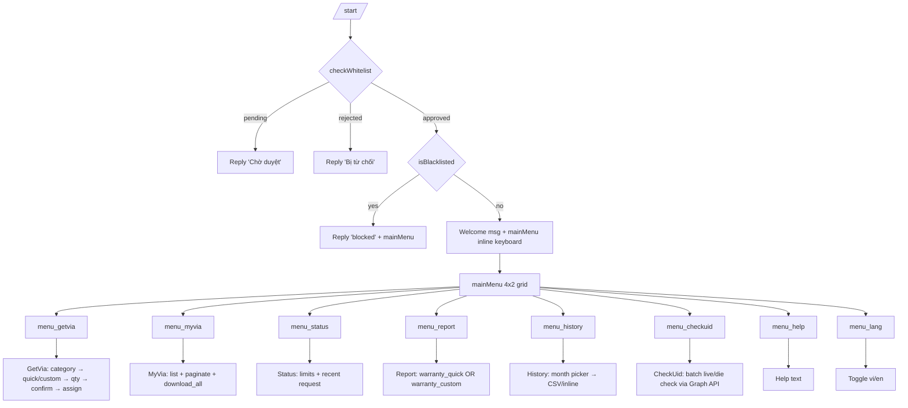

# LEARN_VIA_BOT — Phân tích workflow VIA Telegram bot

Source: `C:\Users\Admin\Documents\quản lý via, giao via và gửi via qua bot tele\src\lib\bot\`
Mục đích: rút bài học để port sang `proxy-manager-telebot/src/lib/telegram/`.

---

## 1. Sơ đồ workflow tổng thể

### 1.1 Stack & topology

```
Telegram Update (webhook)
   │
   ▼
/api/telegram/webhook (Next.js route)
   │
   ▼
setup.ts → getBot() → grammy Bot (singleton, Proxy lazy-init)
   │
   ├── _bot.api.config.use(...)        ← outgoing API interceptor (auto-log mọi sendMessage / sendDocument / edit / forward)
   ├── registerCommandHandlers          ← handlers/commands/*.ts
   ├── registerCallbackHandlers         ← handlers/callbacks/*.ts (route table)
   ├── registerMessageHandlers          ← handlers/messages/index.ts (state machine dispatcher)
   ├── registerGroupMembershipHandler   ← my_chat_member event (Wave 46)
   ├── registerUnsupportedHandlers      ← photo/sticker/voice/...
   └── _bot.catch(err)                  ← global error sink
```

### 1.2 Mermaid: /start → menu → các nhánh



---

## 2. 11 flow chi tiết

### 2.1 `/start` → main menu

| Field | Value |
|---|---|
| Trigger | `bot.command('start')` |
| File | `handlers/commands/start.ts` |
| State | `clearState(userId)` |
| DB tables | `bot_whitelist`, `settings` (welcome msg + show_via_count), `vias` (count) |
| Side effects | Auto-create whitelist row nếu user mới (`pending`) + notify admin với approve/reject buttons |
| Output | Welcome text + `mainMenu(lang)` inline keyboard 4×2 |

### 2.2 `/getvia` → category → quick/custom → quantity → confirm → assign

| Step | Trigger | State | Action |
|---|---|---|---|
| 1. Entry | `/getvia` hoặc `menu_getvia` | `idle` | `handleGetViaFlow` |
| 2. Pre-check | — | — | settings cooldown, blacklist, pending request, pending custom_order, available count |
| 3. Category list | shows | — | RPC `get_category_via_counts` (skip empty cats) |
| 4. Select cat | `select_cat_<uuid>` | — | Validate UUID regex |
| 5. Order type | `order_quick_<uuid>` / `order_custom_<uuid>` | `awaiting_quantity` HOẶC `awaiting_custom_qty` | Set state |
| 6a. Qty (quick) | text input | `awaiting_confirm` | parse int, validate `max_via_per_request`, check inventory; nếu vượt → auto-route sang custom |
| 6b. Qty (custom) | text input | `awaiting_custom_reason` | cap 1000; check inventory |
| 7a. Confirm quick | `confirm_yes` / `confirm_no` | `idle` | `processGetVia` → RPC `assign_vias` → file/text delivery |
| 7b. Reason | text (or 'skip') | `awaiting_custom_confirm` | Markdown-escape, build summary |
| 8. Custom confirm | `co_confirm_yes` | `idle` | INSERT `custom_orders`, decideAutoApprove → either approve_custom_order RPC + deliver, hoặc notify admin với approve/reject buttons |

DB: `categories`, `vias`, `requests`, `custom_orders`, `distribution_history`, `user_limits`, `settings`, `bot_files`.
Side effects: rate-limit 4-way kiểm tra song song (lifetime + hourly + daily + pending); rollback distribution nếu delivery fail; audit log `custom_order_auto_approve` với reason; cross-notify admin khác với `excludeChatId`.

### 2.3 `/myvia` → list + paginate + download

| Step | Trigger | DB | Output |
|---|---|---|---|
| Entry | `/myvia` / `menu_myvia` | — | Show summary + keyboard `myvia_view_recent` / `myvia_view_paginated` / `myvia_download_all` |
| Recent | `myvia_view_recent` | `distribution_history` JOIN `vias` | 10 vias inline HTML |
| Paginated | `myvia_page_<size>_<page>` | same | Page nav buttons |
| Download all | `myvia_download_all` | batch up to 500 (BATCH_SIZE=100) | Generate `.txt` file via `generateViaFileContent`, send via `sendViaFile`, log to `bot_files` |

`answerCbBefore: bt('myvia.downloading', lang)` cho phép trả lời callback trước khi handler chạy (giảm cảm giác "đơ").

### 2.4 `/report` → uid → reason → submit

| Step | State | Notes |
|---|---|---|
| Entry | `idle` | `handleReportMenu` → `warrantyTypeKeyboard` (quick / custom / cancel) |
| Quick path | — | List 10 distributed vias as `report_uid_<uid>` buttons + "Nhập UID" + cancel |
| Direct CLI | — | `/report <uid> <reason>` → `processReport` luôn |
| Single UID | `awaiting_report_reason` | Set `reportUid`, ask reason |
| Multi UID | `awaiting_report_multi_reason` | Up to 10 UIDs; batch validate ownership + status='distributed'; lưu `reportUids` (comma-separated trong `report_uid` column) |
| Reason | text | substring(0,500); `'skip'` → 'No reason given' |
| Submit | — | `processReport` per UID → notify admin với approve/reject + audit + cross-notify |

DB: `vias`, `distribution_history`, `warranty_claims`, `audit_logs`.

### 2.5 `/history` → month picker → CSV/inline

| Step | Trigger | Action |
|---|---|---|
| Entry | `/history` / `menu_history` | `monthSelectorKeyboard` — 6 months, 2 per row, "<-" trên tháng hiện tại |
| Pick month | `history_<YYYY>_<MM>` | `generateMonthlyReport` |
| Inline | `viaCount ≤ 5` | `<pre>...</pre>` HTML |
| CSV file | `viaCount > 5` | `sendViaFile` với filename `via-report-YYYYMM-@username.csv`, log to `bot_files` trigger=`myvia_export` |

`answerCbBefore: bt('history.generating', lang)` → user thấy popup "Đang tạo báo cáo..." ngay.

### 2.6 `/checkuid` → batch live/die

| Step | Action |
|---|---|
| Trigger | `/checkuid` / `menu_checkuid` |
| Cooldown | 30s |
| Fetch | `vias WHERE distributed_to=userId AND status IN ('distributed','reported') AND org_id=orgId` |
| Indicator | `replyWithChatAction('typing')` + "Đang kiểm tra {count} via..." |
| Check | `checkUidsWithCache` (Graph API + cache) |
| Update | `vias.uid_status = result.status` (parallel) |
| Output | `editMessageText` summary live/die/error + danh sách UID die (escapeMarkdown) |

CRITICAL: query phải có `eq('org_id', orgId)` UNCONDITIONAL — Wave 53 SEC fix B18-02 (cross-tenant leak nếu orgId rỗng).

### 2.7 `/warranty` → claim list

| Step | Action |
|---|---|
| Trigger | `/warranty` / `nav_warranty` |
| Cooldown | 30s |
| Output | `showWarrantyClaims` (shared/warranty-view.ts) — list active claims với status |
| Empty | "Bạn chưa có yêu cầu bảo hành nào" |

### 2.8 `warranty_custom` (multi-UID conversation)

| Step | State | Action |
|---|---|---|
| Entry | from `menu_report` → `warranty_custom` button | `awaiting_warranty_uids` |
| Input | text (multiline UIDs, tối đa 20) | Validate per-day limit (`warranty_max_per_day` = 3 default), batch fetch vias + history (ownership + period), filter |
| Decision | per UID | `decideAutoApprove` (force_level/per-user/global precedence) |
| Auto path | nếu `effectiveAutoWarranty` | Pick replacement same category (`distribute_live_only` filter) → atomic update → INSERT `warranty_claims` + `distribution_history` → status `auto_replaced` + `warranty_status='replaced'` (sticky), preserve `distributed_to` |
| Manual path | else | RPC `create_warranty_claim` (atomic) → status `pending` |
| Output | Auto-replaced HTML msg + `deliveryActionsKeyboard('w', warrantyBatchId)` + per-claim notify admin với `wc_approve_<id>` / `wc_reject_<id>` + URL btn |
| Receipt | — | `logFileDelivery(trigger='warranty', request_id=warrantyBatchId)` — synthetic batch để Resend/Copy/Download replay |

Audit: `warranty_auto_replace_batch` với `warrantyDecision.reason`.

### 2.9 `/custom-order` (entry through `/getvia` over-limit)

Note: KHÔNG có command `/custom-order` riêng — flow nằm trong `/getvia` khi qty > max:

```
qty > maxVia → bt('custom.over_limit') → setState awaiting_custom_reason
            → reason text → setState awaiting_custom_confirm + summary
            → co_confirm_yes → INSERT custom_orders + auto-approve / notify admin
```

### 2.10 `/lang` → toggle vi/en

| Step | Action |
|---|---|
| Trigger | `/lang` / `menu_lang` |
| Whitelist | gate (Wave 53 fix — cũ đã write DB cho blacklisted) |
| Action | toggle vi↔en, `saveLang(userId, newLang, orgId)` |
| Output | `bt('lang.switched', newLang)` + new mainMenu |

`saveLang` upsert vào `settings WHERE key=lang_<userId> AND org_id=...` với `onConflict: 'key,org_id'`.

### 2.11 `/status` → quota display

| Step | Action |
|---|---|
| Trigger | `/status` / `menu_status` |
| DB | `user_limits`, `requests` (latest), `distribution_history` (today/total) |
| Output | `showStatus` — display max_via_per_request, max_vias_total, max_vias_per_day, max_requests_per_hour, used today/total, latest request status, `nav_getvia` / `nav_myvia` / `nav_warranty` buttons |

### 2.12 Delivery actions (Wave 31)

3 button mọi delivery message: `🔄 Resend / 📋 Copy / 📎 Download`.

| Action | Pattern | Behavior |
|---|---|---|
| Resend | `d_rs:<r/c/w>:<uuid>` | Re-send same .txt từ `bot_files` |
| Copy | `d_cp:<r/c/w>:<uuid>` | Send HTML `<code>` + `<tg-spoiler>` chunks (4000 chars) |
| Download | `d_dl:<r/c/w>:<uuid>` | Force .txt attach |

Cooldown 10s/action. Source = r (request) | c (custom_order) | w (warranty). Lookup `bot_files WHERE telegram_user_id + trigger + request_id + org_id`.

---

## 3. State machine schema chi tiết — `bot_state` table

```sql
bot_state (
  user_id text,
  bot_type text,                  -- 'main' (via) | 'proxy' | 'uid_check'
  step text,
  category_id text,
  category_name text,
  quantity int,
  report_uid text,                -- single OR comma-separated cho multi
  custom_reason text,
  updated_at timestamptz,
  PRIMARY KEY (user_id, bot_type)
)
```

| Step | Set bởi | Context fields cần | Next state(s) |
|---|---|---|---|
| `idle` | `clearState`, sau khi flow xong | — | any |
| `awaiting_quantity` | `order_quick_*` | `categoryId`, `categoryName` | `awaiting_confirm` (nếu hợp lệ) hoặc `awaiting_custom_reason` (nếu over limit) |
| `awaiting_confirm` | qty hợp lệ | + `quantity` | `idle` (sau xác nhận) |
| `awaiting_custom_qty` | `order_custom_*` | `categoryId`, `categoryName` | `awaiting_custom_reason` |
| `awaiting_custom_reason` | qty hợp lệ | + `quantity` | `awaiting_custom_confirm` |
| `awaiting_custom_confirm` | reason | + `customReason` | `idle` (sau co_confirm_yes/no) |
| `awaiting_report_uid` | `report_enter_uid` | — | `awaiting_report_reason` (1 UID) hoặc `awaiting_report_multi_reason` (≥2 UID) |
| `awaiting_report_reason` | UID validated | `reportUid` | `idle` |
| `awaiting_report_multi_reason` | nhiều UID validated | `reportUids[]` | `idle` |
| `awaiting_warranty_uids` | `warranty_custom` | — | `idle` |

**TTL = 30 phút** — enforce ở read-time (`getState`) chứ không có cron clean. Stale → auto `clearState`.

**Validation guard**: `getState` validate `step` against `VALID_STEPS`; nếu corrupt → `clearState` + log warn.

**Multi-UID encoding**: `reportUids` lưu dưới dạng comma-separated trong `report_uid` column. `getState` detect `,` để parse thành array.

---

## 4. Callback prefix taxonomy

### 4.1 Domain user-facing

| Prefix | Domain | Ví dụ | Type |
|---|---|---|---|
| `menu_*` | navigation | `menu_getvia`, `menu_myvia`, `menu_status`, `menu_report`, `menu_history`, `menu_checkuid`, `menu_help`, `menu_lang` | exact |
| `back_main` | navigation | — | exact |
| `cancel_flow` | navigation | — | exact |
| `select_cat_<uuid>` | getvia | `select_cat_all`, `select_cat_<uuid>` | prefix |
| `cat_empty_*` | getvia | popup "hết hàng" | prefix |
| `order_quick_<uuid>` | getvia | — | prefix |
| `order_custom_<uuid>` | getvia | — | prefix |
| `confirm_yes` / `confirm_no` | getvia | — | exact |
| `co_confirm_yes` / `co_confirm_no` | custom_order | user xác nhận | exact |
| `myvia_view_recent` / `myvia_view_paginated` | myvia | — | exact |
| `myvia_page_<size>_<n>` | myvia | — | prefix |
| `myvia_download_all` | myvia | — | exact |
| `nav_getvia` / `nav_myvia` / `nav_warranty` | status | nav từ `/status` | exact |
| `report_enter_uid` | report | "Nhập UID khác" | exact |
| `report_uid_<uid>` | report | quick-select via | prefix |
| `warranty_quick` / `warranty_custom` | report | — | exact |
| `history_<YYYY>_<MM>` | history | tháng picker | prefix |
| `d_rs:<source>:<uuid>` | delivery | Resend | prefix |
| `d_cp:<source>:<uuid>` | delivery | Copy | prefix |
| `d_dl:<source>:<uuid>` | delivery | Download | prefix |

### 4.2 Admin-facing (gated `isTelegramAdmin`)

| Prefix | Domain | Action |
|---|---|---|
| `wl_approve_<userId>` / `wl_reject_<userId>` | whitelist | duyệt user mới |
| `req_approve_<uuid>` / `req_reject_<uuid>` | request | duyệt /getvia request |
| `co_approve_<uuid>` / `co_reject_<uuid>` | custom_order | duyệt custom order |
| `wc_approve_<uuid>` / `wc_reject_<uuid>` | warranty | duyệt warranty claim |

### 4.3 Routing pattern

`handlers/callbacks/index.ts` aggregate domain modules → split thành 2 cấu trúc:
- **`exactRoutes: Map<string, CallbackRoute>`** → O(1) lookup
- **`prefixRoutes: CallbackRoute[]`** → scan thứ tự, `data.startsWith(pattern)`

`findRoute(data)`: thử exact trước, fallback prefix. Mỗi route có:
- `pattern`, `type` ('exact'|'prefix')
- `handler(ctx, userId, data, lang, { username, orgId })`
- `answerCb` (default true) — gọi `safeAnswerCb` sau handler
- `answerCbBefore` (string | (lang) => string) — popup TRƯỚC handler chạy (UX cho long-running)

---

## 5. i18n architecture — domain split

### 5.1 Layout

```
i18n/
├── index.ts        ← export bt, getLang, loadLang, loadLangs (batch), saveLang; aggregate botTexts
├── common.ts       ← welcome, menu, blocked, cooldown, validate.*, error.*, lang.*, limit.*, admin.*, summary.daily
├── getvia.ts       ← getvia.*, confirm.*, success.*, custom.* (order flow)
├── myvia.ts        ← myvia.*, downloading
├── status.ts       ← status.*, nav.*
├── report.ts       ← report.*, warranty.*
├── whitelist.ts    ← whitelist.* (pending, rejected, approved_notify, ...)
├── checkuid.ts     ← checkuid.*
└── history.ts      ← history.*
```

### 5.2 Tại sao split theo domain

1. **Cohesion**: edit getvia copy → mở 1 file ~50 dòng thay vì 1 file ~500 dòng.
2. **Diff readability**: PR đụng tới myvia chỉ thấy `i18n/myvia.ts` thay đổi.
3. **Tree-shaking** (theoretical): nếu sau này lazy-load domain riêng, có thể tách bundle.
4. **Conflict resolution**: 2 dev đụng 2 domain khác → không merge conflict.
5. **Mental model 1-1 với handler folder**: `handlers/callbacks/getvia.ts` ↔ `i18n/getvia.ts`.

### 5.3 Public API

```ts
bt(key: string, lang: BotLang, vars?: Record<string, string|number>): string
```
- Fallback chain: `botTexts[key][lang]` → `botTexts[key]['vi']` → key string itself.
- `{name}` interpolation regex `\\{${k}\\}` (g).
- Dev mode: missing key → `logger.warn('[bot-i18n] Missing key', { key })`.
- LRU cache 1000 users / 10min TTL cho lang preference.
- `loadLangs(userIds[])` — batch load 1 round-trip cho fanout cron / broadcast.

---

## 6. Pattern advanced đáng học

### 6.1 Dead letter queue (`dead-letter.ts`)

**Vấn đề**: webhook handler throw → Telegram interpret 500 = retry → exponential hammering up to 7 days.

**Giải**: webhook ROUTE wraps `handleUpdate` trong try/catch:
```
try { await handleUpdate(req); return 200 }
catch (err) {
  await writeBotWebhookDeadLetter({ botType, rawBody, error });
  return 200;  // luôn ACK
}
```
- Bảng `bot_webhook_dead_letter (bot_type, update_id, update_payload, error_message, created_at)`
- UPSERT với `onConflict: bot_type,update_id, ignoreDuplicates: true` — Telegram retry trùng update_id sẽ skip.
- Admin replay từ dashboard.

### 6.2 File delivery + Resend/Copy/Download (Wave 31)

**Vấn đề**: 15+ vias inline → exceed Telegram 4096-char → throw → rollback → user thấy "approved!" + "error!".

**Giải**:
- `shouldUseFileDelivery(count, orgId)` so threshold setting.
- `hasLongViaData(vias, 2000)` force file mode kể cả ít vias nếu data dài.
- `generateViaFileContent` produce .txt với **raw lines top + delimiter + per-via header** (raw block → user copy paste vào Sheet).
- `sendViaFile` → `bot.api.sendDocument(chatId, InputFile(buffer, filename), {caption, parse_mode:'HTML', reply_markup})`.
- `logFileDelivery` → `bot_files` row với `file_content = encryptIfConfigured(text)`, `request_id = source_uuid`, `trigger`.
- 3 callback `d_rs/cp/dl` đọc lại từ `bot_files` → replay delivery.

Format callback `d_<2chars>:<1char>:<uuid>` ≈ 43 bytes — dưới 64 byte Telegram limit kể cả full UUID.

### 6.3 Auto-approve precedence (`auto-approve.ts`)

Tách `decideAutoApprove({ force, forceLevel, perUser, globalDefault })` → return `{ auto, reason }`. Lý do (Agent Z1 H2): trước đây 4 file inline duplicate logic, drift được tìm thấy.

**Precedence chain (high → low)**:
1. `forceLevel='hard'` → auto, reason='force_hard'
2. `forceLevel='soft'` AND `perUser='off'` → manual, reason='user_opt_out_honored'
3. `forceLevel='soft'` → auto, reason='force_soft'
4. `perUser='on'` → auto, reason='user_opt_in'
5. `perUser='off'` → manual, reason='user_opt_out'
6. `globalDefault='true'` → auto, reason='global'
7. else → manual, reason='manual'

`reason` ghi vào audit log → admin truy "tại sao auto?". Truth table tests pin all 12 cases.

### 6.4 Cache layer

| Cache | File | TTL | Notes |
|---|---|---|---|
| Settings | `cache.ts` (re-export `@/lib/shared/settings/cache`) | — | `getSettings(supabase, orgId)`, invalidate on settings update |
| Whitelist | `whitelistCache` | — | Key `${userId}:${orgId}:${chatKind}` — chỉ trust cached `'approved'`, pending/rejected re-verify DB |
| Lang | `userLangCache` LRU 1000 / 10min | 10 min | per-user lang |
| Chat member | `chat-member-cache.ts` | 60s | `${chatId}:${userId}` → admin/member; cap 2000 entries; FIFO eviction |
| Blacklist | `isBlacklisted` | — | per-org Set<userId> in-memory |

### 6.5 Whitelist gate + auto-approve heuristic

`check-whitelist.ts` flow:
1. `settings[settingKey] !== 'true'` → `'disabled'` (whole feature off).
2. Group chat AND `bot_groups_enabled !== 'true'` → `'disabled'`.
3. Cache hit `'approved'` → return early.
4. Query `bot_whitelist`. Nếu null:
   - User mới: nếu **`message_logs count >= 5`** (existing user) → auto-approve `'auto_existing_user'`.
   - Group: skip heuristic, register pending.
   - else → upsert pending + notify admin với inline `wl_approve_/wl_reject_` buttons.
5. `'pending'`/`'rejected'` re-attempt → cooldown notify admin (5min/user).

### 6.6 Group admin gate (Wave 46)

`group-admin-gate.ts` chặn member non-admin trigger state-mutating commands:
- Private DM → cho qua.
- Group/supergroup + `bot_groups_enabled='true'` + role ∈ {creator,administrator} → OK.
- Else → reply localized "Only group admins" + return false.

Gắn vào `/getvia`, `/report`. Cache 60s LRU.

### 6.7 Outgoing API auto-log (`setup.ts`)

`_bot.api.config.use(async (prev, method, payload, signal) => {...})` middleware:
- Intercept tất cả `sendMessage`/`sendDocument`/`sendPhoto`/`editMessageText`/`forwardMessage`/`copyMessage`/`sendMediaGroup`/...
- Auto `logBotMessage(chatId, text, replyMarkup, 'via')` — fire-and-forget với warn-on-fail (không silently swallow).
- Conversation view ở admin dashboard không miss message.

### 6.8 Rollback distribution on delivery fail

Pattern lặp lại ở `request.ts`, `custom-order.ts` (auto + admin approve):
1. delivery throw (e.g. user blocked bot 403).
2. Detect `is403 = msg.includes('403') || msg.includes('Forbidden')`.
3. UPDATE `vias SET status='available', distributed_to=null, distributed_*=null WHERE uid IN (...) AND org_id=... AND status='distributed'`.
4. DELETE `distribution_history WHERE telegram_user_id=... AND via_id IN (...)`.
5. UPDATE `custom_orders SET status='delivery_failed', admin_note=existingNote+failNote` (rowcount-verified).
6. Notify admin `⚠️ Delivery failed (...) Status: rolled back OK / ROLLBACK FAILED`.
7. Cho `requests` table: schema không có `delivery_failed` enum → log audit `request_delivery_failed` thay vì update status.

### 6.9 Bilingual + admin always vi

Tất cả admin-facing strings hardcoded `adminLang = 'vi' as const`. User-facing dùng user pref (lang param từ ctx).

### 6.10 Cross-notify exclusion

`notifyAdmins(bot, msg, { excludeChatId: userId })` — admin A duyệt → A không nhận notify echo của chính mình; admin B/C nhận.

### 6.11 Decryption integrity

After RPC trả `result.vias` (encrypted in DB):
1. `decryptViaData(v.data)` per via.
2. Filter `v.data === '[DECRYPTION_FAILED]'` → push to badVias.
3. Rollback ONLY badVias (preserve good ones).
4. Notify admin `bt('admin.decrypt_failure', 'vi', {count, user})`.
5. Nếu tất cả bad → notify user `error.decrypt_all_failed`.

### 6.12 Sticky `reported` status

Migration 135 fix: khi report/warranty → giữ `distributed_to` thay vì NULL ra. Lý do: audit "via này từng giao cho ai?" phải work bất kể outcome warranty.

### 6.13 Atomic RPC patterns

| RPC | Atomic ops |
|---|---|
| `assign_vias` | pick + lock + update + insert history |
| `approve_request` | pick + assign + update request status + decrypt |
| `approve_custom_order` | same as request, with category filter |
| `approve_warranty_claim` | original via→reported+replaced, replacement→distributed, claim→auto_replaced |
| `create_warranty_claim` | INSERT claim + UPDATE via.note in 1 txn (mig 064) |
| `get_category_via_counts` | per-category available count (replaces SELECT * + JS counting) |

Client-side 2-step (INSERT then UPDATE) đã từng leak orphan claims hoặc reported-without-claim → all critical writes giờ qua RPC.

### 6.14 Settings tri-state force_level

Wave 18: `force` boolean → `force_level` enum `off/soft/hard`:
- `hard` = bulldozer, override mọi opt-out.
- `soft` = default auto, nhưng tôn trọng `perUser='off'` (linh động).
- `off` = legacy precedence.

### 6.15 Multi-tenant org_id discipline

**Wave 53 SEC B18-02**: queries phải `eq('org_id', orgId)` UNCONDITIONAL. Pre-fix `if (orgId)` filter cho phép orgId rỗng leak data cross-tenant. `org-resolver.ts` resolve from telegram_user_id; nếu rỗng → handler abort.

---

## 7. So sánh proxy bot hiện tại vs VIA bot

### 7.1 Proxy bot file map

```
proxy-manager-telebot/src/lib/telegram/
├── bot.ts
├── handlers.ts
├── messages.ts
├── state.ts
├── commands/
│   ├── start.ts, help.ts, language.ts, support.ts, status.ts, history.ts
│   ├── get-proxy.ts, my-proxies.ts, check-proxy.ts, revoke.ts
│   ├── bulk-proxy.ts, custom-order.ts, cancel.ts, aup.ts
│   └── admin-approve.ts, assign-proxy.ts
├── guards.ts, rate-limit.ts, ip-whitelist.ts
├── format-proxies.ts, send.ts, revoke.ts, simulator.ts
├── keyboard.ts, logging.ts, notify-admins.ts, user.ts, webhook-queue.ts
```

### 7.2 Khoảng cách

| Mảng | VIA bot | Proxy bot | Gap |
|---|---|---|---|
| **Folder structure** | `handlers/{commands,callbacks,messages}/` split + i18n/ split | `commands/` flat, callback chưa thấy split | Port cấu trúc `handlers/callbacks/` route table |
| **Callback routing** | `exactRoutes: Map` + `prefixRoutes: []`, O(1) + ordered scan | If/else chain (assumption) | HIGH — port `CallbackRoute` interface + dispatcher |
| **State machine** | 10 step enum + TTL 30min + corruption recovery | `state.ts` simpler | MEDIUM — port `VALID_STEPS` validation + multi-UID encoding |
| **i18n domain split** | 8 files (common + 7 domain) | `locales/` (chưa rõ structure) | MEDIUM — split khi code base đủ lớn |
| **Dead letter queue** | `bot_webhook_dead_letter` upsert dedupe | `webhook-queue.ts` (queue khác mục đích?) | HIGH — verify presence; port idempotent dead-letter |
| **File delivery + Resend/Copy/Download** | Wave 31 full pattern, `bot_files` audit | `format-proxies.ts` (chỉ format?) | HIGH — port `bot_files` table + 3 callback action; KEY UX win |
| **Auto-approve precedence** | `decideAutoApprove` shared helper, tri-state force_level, audit reason | unknown | MEDIUM — kiểm tra rồi port nếu đang inline |
| **Whitelist + auto-approve heuristic** | `>=5 message_logs → auto-approve` | unknown | MEDIUM — feature, không bắt buộc |
| **Chat member cache** | LRU 60s for group admin gate | unknown | LOW (chỉ cần khi support group) |
| **Outgoing API interceptor** | Auto-log mọi method via `bot.api.config.use` | manual logging | HIGH — port → conversation view bao quát |
| **Rollback delivery fail** | 4-step rollback + notify admin pattern | unknown | HIGH — bắt buộc cho đảm bảo inventory |
| **Decryption integrity check** | Filter `'[DECRYPTION_FAILED]'` per via, partial rollback | N/A nếu proxy không encrypt | LOW |
| **Cross-notify excludeChatId** | có | unknown | MEDIUM — UX cho admin |
| **Atomic RPC** | mọi state mutation qua RPC (assign, approve_*, create_warranty) | unknown | HIGH — verify proxy có equivalent stored procs |
| **`answerCbBefore`** | UX pattern cho long-running | unknown | LOW — nice-to-have |
| **Tri-state force_level** | Wave 18 enum | unknown | MEDIUM |
| **Sticky reported state** | Mig 135 preserve distributed_to | unknown | MEDIUM (parity với warranty rollback) |

### 7.3 Port roadmap đề xuất (priority order)

1. **Wave 18A: Callback route table refactor** — port `CallbackRoute` interface + `exactRoutes` Map + `prefixRoutes` Array dispatcher. Lợi: thêm callback mới = thêm 1 dòng route, không sờ if/else trung tâm.

2. **Wave 18A: Dead letter queue** — bảng `bot_webhook_dead_letter` + `writeBotWebhookDeadLetter` upsert dedup. Lợi: stop Telegram retry storm.

3. **Wave 18A: Outgoing API interceptor** — `bot.api.config.use(...)` + auto-log mọi outgoing. Lợi: admin conversation view không miss message.

4. **Wave 18B: Rollback delivery fail** — 4-step pattern (vias, distribution_history, order status, notify). Lợi: inventory không bị "ghost distributed" khi user block bot.

5. **Wave 19: File delivery + bot_files + Resend/Copy/Download** — full Wave 31 pattern. Lợi UX: user không bao giờ mất proxy info.

6. **Wave 19: i18n domain split** — chỉ split khi `locales/` > 200 dòng/file.

7. **Wave 20: Auto-approve precedence helper + audit reason** — shared `decideAutoApprove`, audit `reason`. Lợi: admin trace được "tại sao auto?".

8. **Wave 20: Atomic RPCs** — convert client-side 2-step writes thành stored procs. Lợi: không có orphan rows.

9. **Wave 21: Whitelist auto-approve heuristic** — `message_logs >= 5 → auto-approve`. Lợi: friction giảm cho user cũ.

10. **Wave 22: Group support** — chat-member-cache + group-admin-gate + my_chat_member event. Chỉ port khi roadmap có nhu cầu group.

---

## 8. Kết luận

VIA bot đã trải qua ~53 wave hardening — pattern hay nhất tập trung vào:
- **Defensive multi-tenant** (org_id unconditional)
- **Idempotency** (dead-letter dedup, atomic RPCs)
- **Rollback discipline** (4-step on delivery fail)
- **UX polish** (Resend/Copy/Download keyboard, file fallback, answerCbBefore)
- **Audit traceability** (auto-approve reason, cross-notify exclude, outgoing API interceptor)
- **Security hardening** (UUID regex on callbacks, escapeMarkdown for dynamic UIDs, whitelist gate on /lang /cancel)

Proxy bot nên port trước nhất: **callback route table + dead letter queue + outgoing API interceptor + delivery rollback** — 4 mảng đem lại stability + observability ngay lập tức mà không phải re-design domain.
